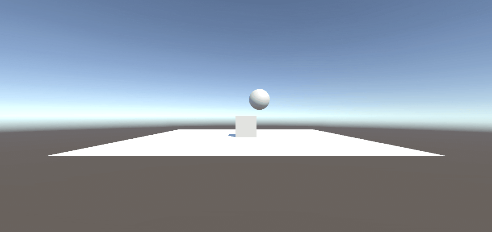
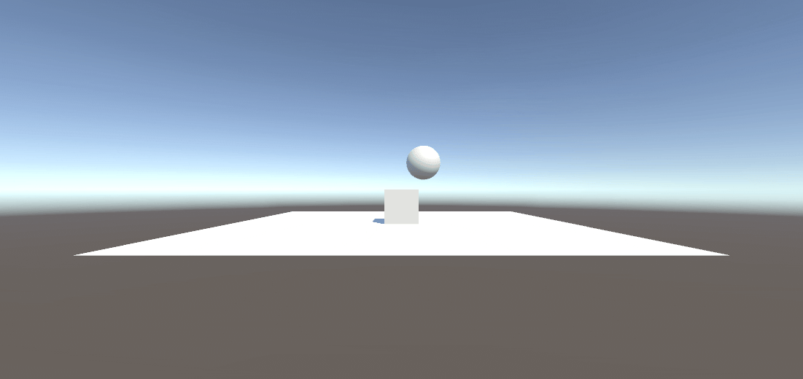

# II p03 Situaciones
## Situación 1
- El plano no es un objeto físico. El cubo es un objeto físico y la esfera no. En este caso, el plano y la esfera sólo tendrán collider, mientras que el cubo debe tener Rigidbody.

**Conclusiones:**
- Un objeto necesita un `Rigidbody` para ser afectado por la `gravedad` y las `fuerzas físicas` en Unity
- El **cubo**, al tener un `Rigidbody` y un `Collider`, debería caer sobre el plano, pero debido a su posición (0, 0.5, 0), este está justo encima del plano, por lo que no se mueve
- La **esfera**, sin `Rigidbody`, no se mueve ni es afectada por la gravedad, quedándose en su posición inicial
- El **plano**, con solo un `Collider`, actúa como una superficie estática que impide que otros objetos físicos lo atraviesen

## Situación 2
- El plano no es un objeto físico. El cubo es un objeto físico y la esfera también. En este caso, el plano sólo tendrán collider, mientras que el cubo y la esfera deben tener Rigidbody.
  

**Conclusiones:**
- Tanto el **cubo** como la **esfera** son objetos físicos porque tienen `Rigidbody`, lo que permite que la gravedad y las colisiones afecten su comportamiento
- La **esfera**, al estar en el aire y tener un `Rigidbody, cae debido a la gravedad y colisiona con los objetos que encuentra (en este caso el cubo y el plano)
- El **cubo**, aunque es un objeto físico, no se mueve porque ya está apoyado en el plano, demostrando que los objetos con `Rigidbody` no se moverán si ya están en contacto con una superficie sólida

## Situación 3
- El plano no es un objeto físico. El cubo es un objeto físico y la esfera es cinemática. En este caso, el plano sólo tendrán collider, mientras que el cubo y la esfera deben tener Rigidbody esta última cinemático.
  

**Conclusiones:**
 
## Situación 4
- El plano es un objeto físico. El cubo es un objeto físico y la esfera es física. En este caso, todos los objetos deben tener Rigidbody.
  

**Conclusiones:**

## Situación 5
- El plano es un objeto físico. El cubo es un objeto físico y la esfera es física con 10 veces más masa que el cubo. En este caso, todos los objetos deben tener Rigidbody.
  

**Conclusiones:**

## Situación 6
- El plano es un objeto físico. El cubo es un objeto físico y la esfera es física con 100 veces más masa que el cubo. En este caso, todos los objetos deben tener Rigidbody.
  

**Conclusiones:**

## Situación 7
- El plano es un objeto físico. El cubo es un objeto físico y la esfera es física con fricción. En este caso, todos los objetos deben tener Rigidbody.
  

**Conclusiones:**

## Situación 8
- El plano es un objeto físico. El cubo es un objeto físico y la esfera no es física y es Trigger. En este caso, todos los objetos deben tener Rigidbody.
  

**Conclusiones:**

## Situación 9
- El plano es un objeto físico. El cubo es un objeto físico y la esfera es física y es Trigger. En este caso, todos los objetos deben tener Rigidbody.
  

**Conclusiones:**
